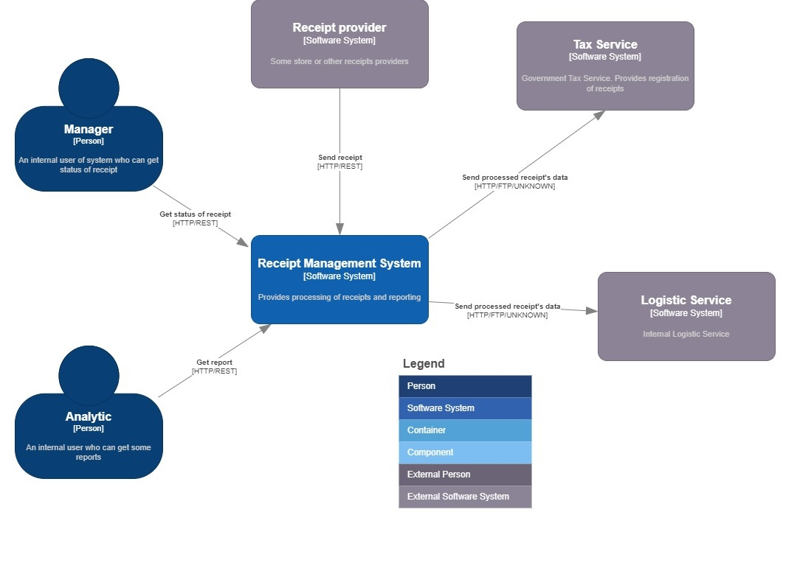
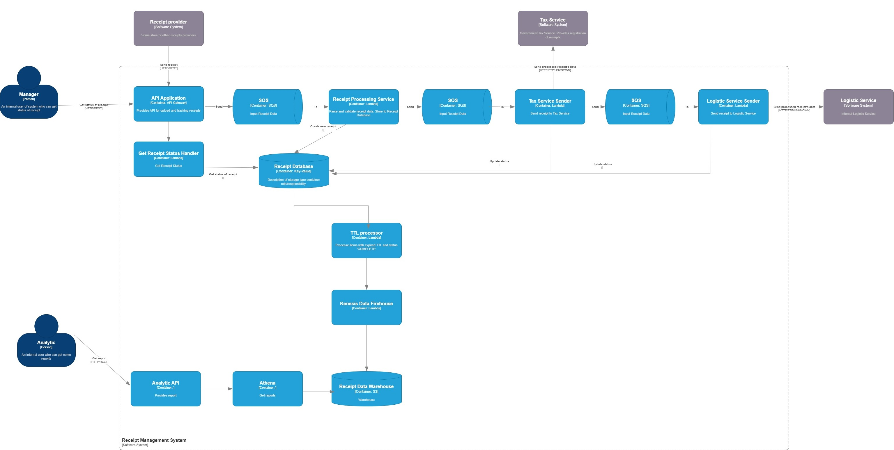

# Temabit test assignment

## Contents

- [System Requirements](#system-requirements)  
    - [Functional Requirements](#functional-requirements)
    - [Architecture Characteristics Requirements](#architecture-characteristics-requirements)
    - [Constraints](#constraints)
    - [Concerns](#concerns)
- [Baseline Architecture](#baseline-architecture)  
- [Target Architecture](#target-architecture)  
    - [Use Case Model](#use-case-model)  
    - [System Context](#system-context)  
    - [Containers](#containers)  
- [Architecture Decision Records](#architecture-decision-records)

**Business Drivers**

 * Business wants to have analytics to make forecasts for the future.
 * Business wants a high-performance system to bring more customers (receipt provider).

**Business Goals**

* Develop a new receipt management system that will satisfy the required qualities.

## System Requirements

### Stakeholders

This section describes key stakeholders of the system and their architectural concerns.

* **SH-1**: **Manager** (availability, performance, scalability, security)
    - managers want the system they're accessing is available anytime they want to use it, and that it responses quickly to their actions;

* **SH-2**: **Analytics** (availability, performance, scalability, security)
    - they want receive analytics data to make forecust or some analysis

* **SH-3**: **Receipt Provider** (availability, security, reability)
    - some retail store or other receipt provider. they want that their receipt could be proccessed at any time

### Functional Requirements

* **UC-1**: **Upload Receipt**:
    - receipt provider (SH-3) uploads receipt to receipt manager system by REST API call, it varified and upload to tax service and logistic service;

* **UC-2**: **Receive analytics**:
    - analytics can receive data for a long term by REST API call (SH-2);

* **UC-3**: **Get receipt status**:
    - manger what to check status of receipt at any time by REST API call (SH-1)

### Architecture Characteristics Requirements

* **QA-1**: **scalability** (UC-1)
    - number of users  > 10000;

* **QA-2**: **availability** (UC-1, UC-3)
    - system should processed 1000RPS at high peak time;
    - 99.9% seems reasonable here;

* **QA-3**: **performance** (UC-1)
    - response time to get status of receipt < 0.5 sec;

* **QA-4**: **performance** (UC-2)
    - response time of analytics  < 30 sec;

### Constraints
* **CON-1**: Integration with AWS. Serverless

### Concerns
* **CONC-1**: We need to process 1000RPS. Potentially it could be 1000RPS-2000RPS to Receipt Database because proccess is durable. 
* **CONC-2**: Let's asuume that regular hours will be from 7-12 and 21-24 hours, high peak load from 12-21. 8h*200 + 9h*1000 = 6.4M +36M = 43M Receipts/Day. if size of receipts is 2kB we need to store around 4kB (original data and metadata). So Receipt database will grow by 172GB (43M * 4kB) per day. 
* **CONC-3**: Data warehouse should store for a last 20 years. It is huge vvalue. Could be issue with analytics

## Target Architecture
This section describes the target software architecture.

Please note that all views are documented in [C4 model](https://c4model.com) style, although only System Context, Containe. The most diagrams use informal notation style. All diagrams are supplied with a key explaining meaning of each shape on the diagram.

### System Context

The system context diagram below depicted key users of the system and its external dependencies:

### Containers

The containers diagram that follows shows the high-level shape of the software architecture and how responsibilities are distributed across containers. It also shows the major technology choices and how the containers communicate with one another.

The architectural style used here as the bases is Serverless architecture (see [ADR-1](ADR/ADR-1-serverless.md) for details).

### Risk Analysis
These are the possible high risks of the transition architecture.

#### Availability
A single API Gateway may introduce a single point of failure for the whole system.

#### Did not have enough time
Did not add deployment diagram
Did not cover QA Security(:

## Architecture Decision Records

> *Why is more important than how.  
Second Law of Software Architecture*

 - [ADR-1](ADR/ADR-1-serverless.md) Use Serverless architectural style as the basic style.
 - [ADR-2](ADR/ADR-2-event-driven-broker.md) Use message queues with guaranteed delivery for processing steps.
 - [ADR-3](ADR/ADR-3-separate-storages.md) Separate receipts and analytics storages.
 - [ADR-4](ADR/ADR-4-separate-receipt-db.md) Use separate receipt database.
 - [ADR-5](ADR/ADR-5-use-dynamodb.md) Use DynamoDb as Receipt Storage.
 - [ADR-6](ADR/ADR-6-use-s3-as-warehouse.md) Use S3 as data warehouse.
 - [ADR-7](ADR/ADR-7-use-athena-for-reporting.md) Use AWS Athena to get analytics
 - [ADR-8](ADR/ADR-8-synchronization-of-storages.md) Synchronization of storages.
